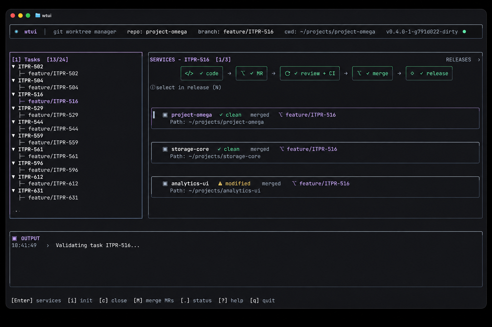
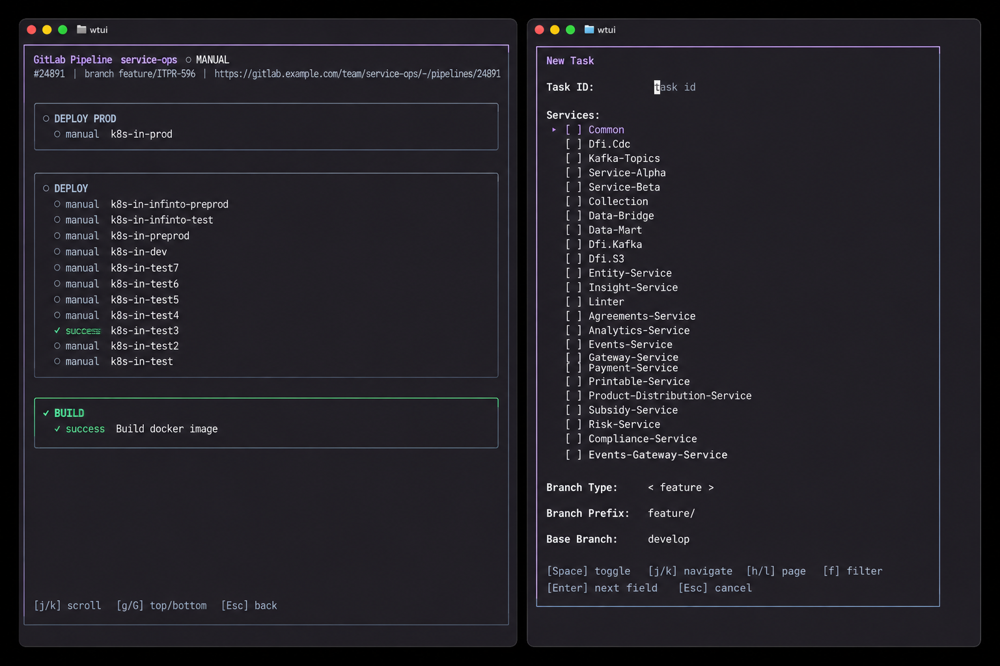

# wtui

**One task, many repositories, one terminal.**

`wtui` is a terminal UI for managing task-scoped Git worktrees across multi-repository and microservice codebases.



## Why wtui

A feature rarely stays inside one repository. You create the same branch several times, arrange worktrees by hand, repeat sync and push commands, then remember which services are ready to merge.

`wtui` treats that work as one task. Pick the repositories once, then manage their worktrees, branches, validation, reviews, and releases from one screen.

## Highlights

- **Task-scoped worktrees** - create matching branches and worktrees across selected repositories.
- **Multi-service operations** - sync, push, validate, and inspect an entire task together.
- **Git Flow support** - use `git-flow`, `github-flow`, `gitlab-flow`, or custom branch rules.
- **GitHub and GitLab workflows** - create and merge PRs/MRs through `gh` or `glab`.
- **Release orchestration** - prepare per-service versions, promote to production, merge, and tag.
- **Focused workspaces** - generate a VS Code workspace and .NET solution for each task.

## Install

Download a binary from [GitHub Releases](https://github.com/D1ssolve/wtui/releases), or install from source:

```bash
go install github.com/D1ssolve/wtui/cmd/wtui@latest
```

## Quick Start

1. Create `~/.config/wtui/config.yaml`:

```yaml
root_dir: /Users/you/dev
tasks_root: /Users/you/dev/.tasks
editor: code

git_flow:
  preset: git-flow
```

2. Start wtui:

```bash
wtui
```

3. Press `i`, enter a task ID, and select the repositories involved.

4. Work from the generated task directory:

```text
.tasks/PROJ-101/
├── gateway/
├── billing/
├── PROJ-101.code-workspace
└── PROJ-101.sln
```

Press `?` inside wtui for context-aware keyboard help.

## Workflows

| Task workflow | Release workflow |
|:--:|:--:|
|  |  |
| Develop, sync, validate, and open reviews as one task. | Prepare versions, promote, merge, and tag from one release view. |

## Optional Tools

- [`lazygit`](https://github.com/jesseduffield/lazygit) for service-level Git operations
- [`gh`](https://cli.github.com) for GitHub pull requests and workflows
- [`glab`](https://gitlab.com/gitlab-org/cli) for GitLab merge requests and pipelines

wtui detects available tools automatically. Press `.` to view current integration status.

## Requirements

- Git 2.5+
- Go 1.26.1+ when installing from source
- A true-color terminal is recommended

## Documentation

- [Complete configuration reference](docs/configuration.md)
- [Releases](https://github.com/D1ssolve/wtui/releases)
- [License](LICENSE)

## Development

```bash
make test
make lint
make build
```
