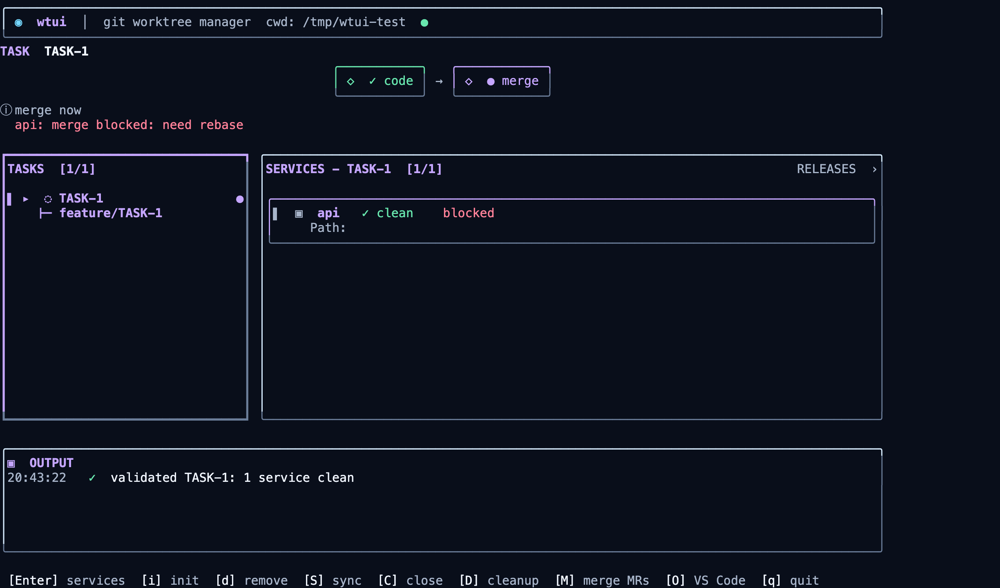
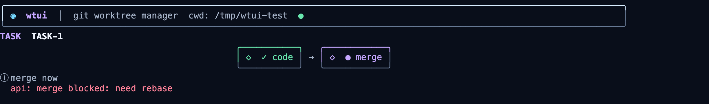
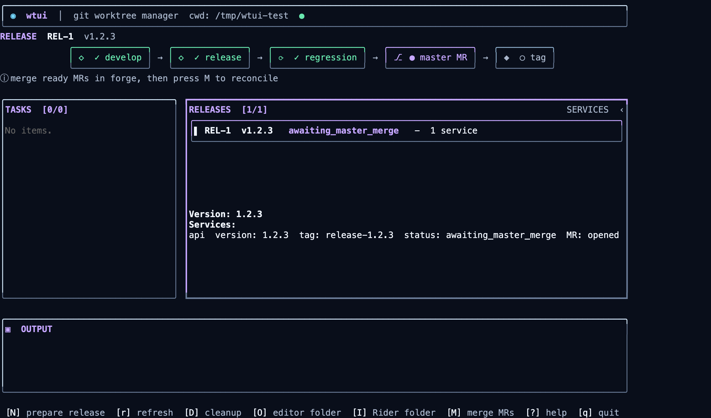

# wtui

**One task, many repositories, one terminal.**

`wtui` is a terminal UI for managing task-scoped Git worktrees across multi-repository and microservice codebases.



## Why wtui

A feature rarely stays inside one repository. You create the same branch several times, arrange worktrees by hand, repeat sync and push commands, then remember which services are ready to merge.

`wtui` treats that work as one task. Pick the repositories once, then manage their worktrees, branches, validation, reviews, and releases from one screen.

## Key terms

- **Task**: a named unit of work (for example `PROJ-101`) that groups the same branch across several repositories.
- **Worktree**: an extra working copy of a repository. Each service in a task gets its own worktree, so you never switch branches in your main clone.
- **MR/PR**: a merge request (GitLab) or pull request (GitHub). wtui creates them; the actual merge happens on GitHub/GitLab.
- **Release**: a separate wtui object that snapshots integrated work, promotes it to production, and tags versions per service.
- **Cleanup**: manual removal of finished task/release worktrees and directories. Always explicit, never automatic.

## Highlights

- **Task-scoped worktrees** - create matching branches and worktrees across selected repositories.
- **Multi-service operations** - sync, push, validate, and inspect an entire task together.
- **Git Flow support** - use `git-flow`, `github-flow`, `gitlab-flow`, or custom branch rules.
- **GitHub and GitLab workflows** - create and inspect MRs/PRs through `gh` or `glab`. Merging stays on the forge; wtui reconciles the result.
- **Release orchestration** - prepare per-service versions, promote to production, and tag from one release view.
- **Focused workspaces** - generate a VS Code workspace and .NET solution for each task.

## Install

Download a binary from [GitHub Releases](https://github.com/D1ssolve/wtui/releases), or install from source:

```bash
go install github.com/D1ssolve/wtui/cmd/wtui@latest
```

## Quick Start

1. Create `~/.config/wtui/config.yaml`:

```yaml
root_dir: /Users/you/dev
tasks_root: /Users/you/dev/.tasks
editor: code

git_flow:
  preset: git-flow
```

`root_dir` is where your service repositories live. `tasks_root` is where task worktrees go. Nothing else is required to start; every other key has a default (see the [configuration reference](docs/configuration.md)).

2. Start wtui:

```bash
wtui
```

3. Press `i`, enter a task ID (for example `PROJ-101`), and select the repositories involved. wtui creates a branch and a worktree per service:

```text
.tasks/PROJ-101/
├── gateway/
├── billing/
├── PROJ-101.code-workspace
└── PROJ-101.sln
```

4. Press `O` to open the task in your editor, write code, and commit as usual.

Press `?` at any time for context-aware keyboard help.

## Everyday flow

The default path from task to a cleaned-up release:

1. **Develop** - work in the task worktrees. `V` validates Git state (clean worktree, no interrupted merge/rebase); it does not run your application tests. `S` syncs branches.
2. **`C` (Close)** - shows a plan, then pushes source branches. What `C` does depends on where the task is: it creates MRs for review, merges directly into configured targets when the branch rule uses `direct_merge`, or, on a hotfix whose MRs are already verified as merged, runs the final tagging step (and the pipeline trigger, if configured).
3. **Review and CI** - complete reviews and wait for CI on GitHub/GitLab.
4. **`M` (Merge)** - rechecks readiness, asks for confirmation, merges ready MRs, and verifies the result.
5. **Release** - in the Releases panel (`3`), press `N` to bundle merged tasks into a release, `F` to promote it to production, complete review and CI, press `M` to merge ready production MRs, then `F` again to finalize tags.
6. **`D` (Cleanup)** - remove the finished task and release worktrees manually. See below.



## Cleanup is always manual

Nothing is deleted automatically. Not after Close, not after an MR merge, not after tagging, not after release finalization. Finished tasks and releases stay on disk until you remove them.

One exception: temporary integration worktrees used internally during release preparation are managed by the release flow itself (see `release.keep_integration_worktrees` in the [configuration reference](docs/configuration.md)). This does not affect your task or release directories.

To clean up:

1. Press `D` (or its alias `P`) in the Tasks or Releases panel.
2. wtui runs a read-only scan and lists candidates. Nothing is touched yet.
3. Select the items you want to remove.
4. Each selected item is replanned and confirmed individually before anything is deleted.

Cleanup removes worktrees, generated metadata, and task/release directories. Local and remote branches and tags are always retained; delete branches on the forge when you no longer need them. Directories containing unknown files are preserved and reported instead of being removed.


## Release workflow at a glance



Prepare per-service versions, promote to production, merge ready MRs, and tag from one release view. Full guides: [Russian](docs/workflows.md) and [English](docs/workflows.en.md).

## Optional Tools

- [`lazygit`](https://github.com/jesseduffield/lazygit) for service-level Git operations
- [`gh`](https://cli.github.com) for GitHub pull requests and workflows
- [`glab`](https://gitlab.com/gitlab-org/cli) for GitLab merge requests and pipelines

wtui detects available tools automatically. Press `.` to view current integration status.

## Requirements

- Git 2.5+
- Go 1.26.1+ when installing from source
- A true-color terminal is recommended

## Documentation

- [Task-to-release workflows, step by step (Russian)](docs/workflows.md)
- [Task-to-release workflows, step by step (English)](docs/workflows.en.md)
- [Manual cleanup guide (Russian)](docs/cleanup.md)
- [Complete configuration reference](docs/configuration.md)
- [Releases](https://github.com/D1ssolve/wtui/releases)
- [License](LICENSE)

## Development

```bash
make test
make lint
make build
```
