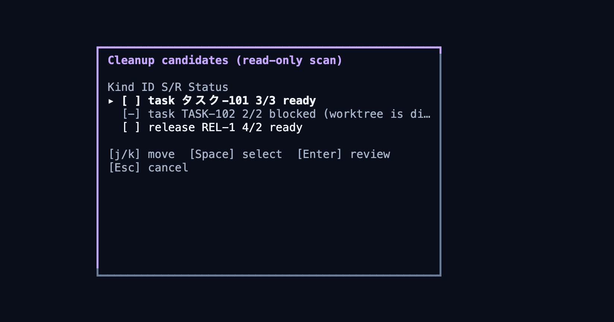

# Ручная очистка (D / P)

Как удалить завершённые задачи и релизы, и что при этом происходит с ветками, тегами и файлами.

## Главное правило

wtui не удаляет ничего автоматически. Ни после Close, ни после merge MR, ни после создания тегов, ни после finalize релиза. Завершённые задачи и релизы остаются на диске, пока вы не удалите их сами.

Единственное исключение — временные integration-worktrees, которые релиз использует как внутренний ресурс во время prepare. Ими управляет сам релиз (см. `release.keep_integration_worktrees` в [configuration.md](configuration.md)); ваши задачи и каталоги релизов это не касается.

## Как запустить очистку

1. Нажмите `D` в панели Tasks или Releases. Клавиша `P` — синоним, тот же обзор очистки.
2. wtui выполняет read-only скан всех задач и released-релизов и показывает список кандидатов. На этом шаге на диске ничего не меняется.
3. Отметьте элементы, которые хотите удалить.
4. Подтвердите. Каждый выбранный элемент перепланируется и подтверждается отдельно: план строится заново, и только после вашего подтверждения что-то удаляется.

## Что удаляется

- Worktrees сервисов задачи или релиза.
- Сгенерированные метаданные задачи (workspace-файлы, checkpoint `.hotfix-close.json`).
- Каталог задачи или релиза и manifest релиза.

## Что сохраняется

- **Локальные ветки** — всегда.
- **Remote-ветки** — всегда. Удаление remote-веток сейчас не поддерживается; удалите их на GitHub/GitLab, когда они больше не нужны.
- **Теги** — никогда не удаляются.

## Защитные проверки

- План проверяет ownership путей, SHA веток и тегов, включение веток в remote targets. Устаревший план блокируется.
- Каталог удаляется, только когда все его элементы известны плану. Неизвестные файлы и каталоги сохраняются и перечисляются в ошибке — рекурсивного удаления чужих данных нет.
- Очистка задачи проверяет Release, включающие эту задачу: активный in-flight статус, recoverable-сбой и malformed/unknown статус блокируют очистку. `released` доказывает интеграцию; `rejected` или nonrecoverable `failed` не блокируют, но и не доказывают — нужно доказательство через live/forge ancestry.
- Для hotfix очистка проверяет интеграцию во все настроенные review targets (live ancestry либо доказательства merged-MR по каждой цели) и требует доказательства выполненных post-actions close (тег/пайплайн). Без доказательств по всем целям и тегам очистка блокируется. Сначала завершите поток по [схеме hotfix](workflows.md), потом очищайте.

## Если очистка сорвалась

Частичный сбой не откатывается: уже удалённое остаётся удалённым. Нажмите `D` ещё раз и постройте новый план — он учтёт текущее состояние диска.
