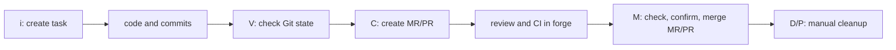
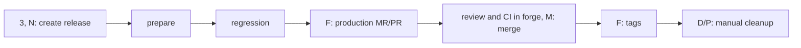
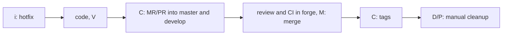

# From Task to Release

[Русский](workflows.md)

Short guide for a normal `git-flow` setup: `develop` is integration and `master` is production.

## Before You Start

1. Create the minimal configuration from the [README](../README.md).
2. Authenticate `glab` for GitLab or `gh` for GitHub.
3. In wtui, press `,` to view the effective configuration and `.` to check available tools.

A **task** groups same-named branches and worktrees across services. wtui creates **MRs/PRs**; review and CI run in the forge. A **release** prepares versions, production MRs/PRs, and tags.

## Feature

1. In Tasks (`1`), press `i`, enter an ID and select services. wtui creates `feature/<TASK>` and a worktree at `<tasks_root>/<TASK>/<service>` for every service.

2. Press `O` for your editor or `R` for Rider. Write code, run application tests, and commit normally. In Services (`Enter` or `2`), press `a` to add a service or `g` to open lazygit.

3. Press `V`. This checks Git state, not application tests. `S` synchronizes branches with the remote.

4. Press `C`, review the plan, and confirm. With `close_strategy: review_request`, wtui pushes branches and creates MRs/PRs into `develop`. With `direct_merge`, it updates configured target branches without an MR/PR.

5. Complete review and wait for CI in the forge. wtui does not delete the task.

6. When MRs/PRs are ready, press `M`: wtui rechecks readiness, asks for confirmation, merges ready requests, then verifies and records the result. For one service: Services, select service, then `m`.

7. When the task is no longer needed, start manual cleanup with `D` or `P`.

## Release

1. In Releases (`3`), press `N`, choose root feature tasks and service versions. The suggested version is the next patch after the local semver tag; without tags it is `0.1.0`.

2. Review the preview and confirm prepare. By default every task branch must already be in `origin/develop`. With `git_flow.task_merge.timing: release_prepare`, each service instead needs one ready MR/PR into `develop`.

3. In `prepared`, run regression manually. If fixes are needed, test, commit, and push them in the release worktree before promotion.

4. Press `F`. wtui creates a `release/<version> → master` MR/PR for every service.

5. Complete review and wait for CI in the forge, then press `M`. wtui checks, confirms, merges ready MRs/PRs, and stores the accepted merge SHA.

6. Press `F` again. wtui checks `master`, merges the release branch back into `develop`, and creates and pushes annotated tags. `released` does not mean deployed.

7. If needed, clean up a released release with `D` or `P`.

Temporary integration worktrees are an internal prepare resource. wtui removes them by default; `release.keep_integration_worktrees: true` preserves them for debugging. This never removes a task or release directory.

## Hotfix

1. Create a task with `i` and choose the `hotfix` type. `hotfix/<TASK>` starts from `master`.

2. Develop and check Git state as for a feature task.

3. Press `C`: wtui creates MRs/PRs into both `master` and `develop`.

4. Complete review and wait for CI for both MRs/PRs in the forge, then press `M`: wtui checks, confirms, and merges ready requests, then verifies and records the result.

5. Press `C` again for versions and tags. If it partially fails, press `C` again: the checkpoint preserves confirmed versions.

6. Clean up only after both merges and post-actions finish.

`F` on a hotfix converts it to a feature task: wtui creates `feature/<TARGET>` from the confirmed SHA, pushes branches with a lease, and deletes only unchanged local hotfix branches. The remote source branch remains.

## Manual Cleanup

Nothing is deleted automatically after Close, merge, tags, or finalize.

1. Press `D` or `P` in Tasks or Releases.

2. wtui shows a read-only candidate list.

3. Select tasks or released releases.

4. Every selected item is planned again and requires separate confirmation.

Cleanup removes worktrees, generated metadata, and task/release directories. Local and remote branches and tags are always retained. A directory with unknown files remains in place and returns an error instead of being recursively deleted.

More detail: [cleanup.md](cleanup.md). All keys and constraints: [configuration.md](configuration.md).

## When an Operation Stops

| Where | What to do |
|---|---|
| Close | Check the push and MRs/PRs, then repeat `C`. |
| Merge check | After review and CI pass, repeat `M`. |
| Release | For a recoverable `failed`, use `R` in Releases. After a partial production merge, use `M`, not `R`. |
| Cleanup | Removed items are not restored. Press `D` or `P` and create a new plan. |
