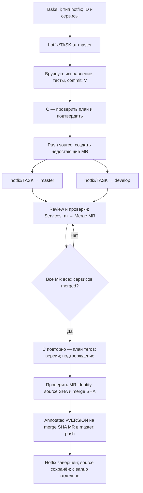

# От задачи до релиза

Задача объединяет рабочие копии нескольких сервисов. Сначала её ветки попадают в `develop` через MR. Затем отдельный Release фиксирует версии сервисов и проводит снимок `develop` через regression, production MR, обратное слияние и теги.

Ниже — поведение текущего кода для проверенного пользовательского YAML: GitLab на частном сервере, preset `git-flow`, `develop` для интеграции, `master` для production. Частные адреса и локальные корни намеренно опущены. Чтение YAML **не доказывает**, что запущенный экземпляр использует именно его: окружение и фактический запуск не проверялись.

## Как выбирается конфигурация

Текущий [entrypoint](../cmd/wtui/main.go) вызывает `config.Load("")`: публичного флага `--config` нет, хотя загрузчик умеет принимать явный путь. При запуске используется первый найденный файл:

1. `$XDG_CONFIG_HOME/wtui/config.yaml`, если `XDG_CONFIG_HOME` задан.
2. `~/.config/wtui/config.yaml`.
3. `config.yaml` рядом с исполняемым файлом.

Файлы не объединяются. Затем непустые `WTUI_ROOT`, `TASKFLOW_ROOT`, `EDITOR`, `WTUI_BASE_BRANCH` переопределяют соответственно `root_dir`, `tasks_root`, `editor`, `base_branch`. Последнее — legacy-поле: оно не переписывает явно заданные `git_flow.branch_types.*.base_branch`. Остальное дополняется defaults. Источник: [config.go](../internal/config/config.go).

В TUI: `1` → Tasks → `,` показывает effective config; `.` — доступность инструментов и forge. Не публикуйте этот экран без редактирования частных значений. Для MR нужен доступный и авторизованный `glab` с доступом к нужным репозиториям; одна запись `forge` в YAML авторизацию не подтверждает.

## Основной поток: feature → release

Схема показывает успешный путь для всех выбранных сервисов. Действия с MR и ветками выполняются отдельно для каждого репозитория, не общей транзакцией.

```mermaid
flowchart TD
    A["Запуск: YAML, env, defaults"] --> B["Tasks: i — ID и сервисы"]
    B --> C["feature/TASK от develop; worktree на сервис"]
    C --> D["Вручную: код, тесты, commit"]
    D --> E["V — validation; S — sync при необходимости"]
    E --> F["C — план Close; Enter — подтвердить"]
    F --> G["Push source; MR feature/TASK → develop"]
    G --> H["Review и CI; устранить blockers"]
    H --> I["Tasks: M — проверить и подтвердить merge"]
    I --> J["Ветки всех сервисов — предки origin/develop"]
    J --> K["Releases: 3, N — выбрать root feature tasks"]
    K --> L["Версия каждого сервиса; preview; подтверждение"]
    L --> M["Prepare: fetch и снимок origin/develop"]
    M --> N["release/version от integration SHA; push и worktrees"]
    N --> O["prepared"]
    O --> P["Вручную: regression; исправления, тесты, commit, push"]
    P --> Q["Releases: F — promote"]
    Q --> R["MR release/version → master на каждый сервис"]
    R --> S["awaiting_master_merge: review и readiness"]
    S --> T["M — merge готовых MR; сохранить AcceptedMergeSHA"]
    T --> U["Все production MR слиты: master_merged"]
    U --> V["F — finalize; origin/master равен принятому SHA?"]
    V --> W["release/version → develop; push integration"]
    W --> X["Тег vVERSION на AcceptedMergeSHA; push tag"]
    X --> Y["released — Git-процесс завершён"]
    Y -.-> Z["Необязательно: D — план cleanup и подтверждение"]
```

### 1. Создать и разработать задачу

- `1` → `i`: введите Task ID, отметьте сервисы пробелом. `Tab` / `Shift+Tab` переключают поля; `Enter` на последнем поле создаёт задачу. Тип по умолчанию — `feature`; для новой ветки ожидаются `feature/<TASK>` и база `develop`.
- На сервис создаётся worktree в `<tasks_root>/<TASK>/<service>`. Существующие локальные/удалённые ветки обрабатываются отдельно: при remote-конфликте TUI предлагает стратегию, поэтому проверьте выбранную ветку, а не считайте её новой.
- `O` в Tasks открывает VS Code workspace, `R` — solution в Rider; `Enter` / `2` переводит в Services. Там `a` добавляет сервис, `g` открывает lazygit, если он доступен. `.sln` зависит от доступности .NET-инструментов и проектов; сбой генерации не равен откату созданных worktrees.
- Код, тесты и коммиты выполняете вы. `V` в Tasks / `v` в Services проверяют Git-состояние, **не запускают тесты**. `S` в Tasks открывает выбор sync-стратегии; это не замена commit или review.
- В профиле нет `worktree.copy`: дополнительного копирования ignored/untracked файлов из исходного репозитория нет. Нужные локальные настройки подготовьте отдельно.

Источники: [создание](../internal/task/init.go), [диалог](../internal/tui/modal/init_dialog.go), [клавиши Tasks](../internal/tui/panels/tasks.go), [справка TUI](../internal/tui/modal/help_overlay.go).

### 2. Интегрировать задачу: Close не означает merge

Основной путь: **Tasks → `C` → план → `Enter`**. Для feature текущий `CloseTask` проверяет задачу, делает fetch, push source и создаёт MR в `develop`. В этом профиле нет тега feature, удаления source-ветки и явного запуска pipeline после Close. Успешный Close здесь означает создание MR, **не** завершённое слияние и не удаление задачи.

После review: **Tasks → `M` → просмотр readiness → подтверждение**. Сливаются готовые MR с `merge_commit`; неготовые пропускаются. Через **Services → `m` → `Merge MR`** можно работать с MR конкретного сервиса. Для обновления списков и workflow используйте `r`.

Есть второй путь: **Services → `m` → `Create missing MR/PRs`**. Несмотря на вход через сервис, действие обходит **все сервисы задачи**, запрашивает общий заголовок и пропускает найденные MR. Оно не вызывает Close-план, validation или push source: ветки должны быть заранее опубликованы. Не путайте его с `C`; подсказка workflow «press C to create MRs» не меняет маршрутизацию `C` в `PlanCloseTask` / `CloseTask`.

Источники: [Close](../internal/task/close.go), [альтернативное создание MR](../internal/task/forge.go), [merge задачи](../internal/task/mr_merge.go), [маршрутизация TUI](../internal/tui/model.go), [forge menu](../internal/tui/modal/forge_menu.go).

> **Readiness не гарантирует зелёный CI.** Текущий [GitLab-клиент](../internal/forge/glab.go) учитывает состояние MR, approval/merge-status, конфликты и обсуждения; неизвестный статус обсуждений тоже блокирует. Внешние status checks проверяются при `status_checks_must_pass`. Но pipeline status сохраняется как информация: `ci_must_pass`, `ci_still_running`, `checking`, `unchecked`, `blocked_status` сами по себе не добавляют blocker. Проверяйте CI отдельно; сервер GitLab всё равно может отклонить merge своими правилами. Это поведение реализации, не пользовательская настройка YAML.

### 3. Выбрать задачи и подготовить Release

**`3` → Releases → `N`**. В выборе задач `/` включает поиск; пока поиск активен, `Space` вводит пробел, а не отмечает задачу. Нажмите `Enter`, чтобы выйти из поиска, затем `Space`, чтобы отметить задачу, и ещё раз `Enter`, чтобы перейти к версиям.

Затем `Tab` / `Shift+Tab` переключают название релиза, версии и описания тегов. На поле описания `Enter` открывает редактор: `Ctrl+S` сохраняет описание, `Esc` отменяет изменения в редакторе. На названии/версии `Enter` отправляет форму. После preview: `Enter` / `y` — выполнить, `Esc` / `n` — отменить.

Версия задаётся **для каждого сервиса**, не обязательно одна на все. Предложение — максимальный semver среди локальных тегов репозитория + patch; без semver-тегов — `0.1.0`. Само предложение не делает fetch и не анализирует Conventional Commits. Проверьте версии перед подтверждением. Описание используется для annotated tag; пустое описание даёт `wtui release <releaseID>`. Название релиза — отображаемый текст, не его ID.

Диалог допускает только root-задачи с phase `feature`. Полная проверка выполняется backend-планом:

| Условие | Что блокирует prepare |
|---|---|
| Выбор | Пустой список, повторы, неизвестная задача, child/non-feature, отсутствие сервисов |
| Повторное использование | Та же задача уже входит в активный Release, а `allow_task_reuse: false` |
| Worktree | Dirty при `require_clean_before_merge: true`; состояния `Conflicted`, `Merging`, `Rebasing`, `CherryPick`, `Reverting`, `Bisect` |
| Интеграция | Хотя бы одна task-ветка не является предком `origin/develop` после fetch |
| Идентичность и версия | Одно имя сервиса указывает на разные репозитории; отсутствующая/невалидная версия; уже существующая локальная/удалённая release-ветка или локальный тег после fetch |

**Удалённый тег отдельно не проверяется.** Prepare выполняет fetch, затем проверяет локальный тег. Если тег остался только на remote, конфликт может обнаружиться лишь при push тега во время finalize, уже после production merge. Источники: [план](../internal/task/release_plan.go), [fetch](../internal/git/git.go), [проверка и push тега](../internal/git/tags.go), [finalize](../internal/task/release_finish.go).

Для запрета reuse активны ровно: `draft`, `validating`, `merging`, `branching`, `prepared`, `awaiting_master_merge`, `master_merged`, `syncing_develop`, `tagging`, `pushing`. `released`, `failed`, `rejected` этот запрет не включают. Это **не вечный запрет** повторного релиза задачи; оставшиеся ветки/теги и остальные проверки всё ещё могут помешать.

**Выбор задач — учёт состава, не фильтр коммитов.** Prepare не cherry-pick'ает задачи и не вливает их feature-ветки: они уже должны быть слиты. Для каждого сервиса создаётся `release/<version>` от зафиксированного SHA `origin/develop`. Все другие изменения, уже попавшие в этот снимок `develop`, тоже входят в релиз, даже если их задачи не выбраны. Проверка ancestry также не считает squash/rebase автоматически эквивалентом исходной feature-ветки; в данном профиле выбран `merge_commit`.

Prepare делает временный detached integration-worktree, проверяет ancestry повторно, создаёт release-ветку и рабочую копию `<release_root>/<releaseID>/services/<service>`, публикует ветки. При текущих флагах временная integration-копия удаляется, release-копии остаются для regression.

ID профиля: `rel-{{.Version}}-{{.Timestamp}}`; timestamp в UTC, формат `YYYYMMDDTHHmmss`, без суффикса `Z`. Одинаковые версии сервисов дают общую нормализованную версию; разные — слово `mixed`. Например, условный ID: `rel-mixed-20260918T120000`. При совпадении каталога добавляется `-2`, `-3` и т. д.

Источники: [диалог Release](../internal/tui/modal/create_release_dialog.go), [версии](../internal/task/release_versions.go), [план и eligibility](../internal/task/release_plan.go), [ID и active statuses](../internal/task/release_helpers.go), [prepare](../internal/task/release_execute.go).

### 4. Regression → production MR → finalization

1. **`prepared`**: `O` в Releases открывает каталог в configured editor, `I` — в Rider. Проведите regression вручную. Исправления в release-worktree нужно протестировать, закоммитить и опубликовать **до promote**; promote не делает это за вас.
2. **`F` — promote**: создаёт или переиспользует открытый MR `release/<version> → master` каждого сервиса. Сохраняет MR number/URL и source SHA. Общий статус — `awaiting_master_merge`.
3. **`M` — inspect/merge**: проверьте readiness и подтвердите. Перед merge используется SHA pin, если forge его поддерживает; иначе проверяется совпадение head SHA. Изменение release-ветки после promote может заблокировать merge. Не обходите проверку: разберите расхождение с сохранённым source SHA.
4. У каждого слитого MR сохраняется **`AcceptedMergeSHA`**. Если MR слит вне wtui, `M` также нужен для фиксации результата. Без достоверного merge SHA сервис не считается завершённым; статус **`master_merged`** появляется только после всех сервисов.
5. **`F` — finalize**: fetch всех сервисов; `origin/master` должен **точно совпасть** с их `AcceptedMergeSHA`. Если production уже продвинулся, операция останавливается с `ERR_RELEASE_MASTER_MOVED`, а не ставит тег на новый HEAD.
6. После проверки wtui сливает **release-ветку в `develop`** и публикует integration. Затем создаёт `v<version>` **на принятом production merge SHA**, не на `develop` и не просто на release HEAD, и публикует теги. Итог — **`released`**. Существующий тег допустим только на ожидаемом SHA.

Секция `tag` в профиле отсутствует: defaults включают semver, `v{{.Version}}`, annotated tags и push. `git_flow.branch_types.release.tag_on_close: false` относится к закрытию task-ветки типа release, а не отменяет теги отдельного Release workflow.

**Ни `prepared`, ни `released` не означают автоматический deploy.** Regression, запуск тестов и решение о выкладке остаются отдельными действиями команды. Push/MR/tag могут запустить настроенный в репозитории CI/CD, но эта конфигурация не доказывает наличие или успешность deployment.

Источники: [promote](../internal/task/release_promote.go), [production merge](../internal/task/release_merge.go), [finalize](../internal/task/release_finish.go), [статусы](../internal/domain/release.go).

## Отдельный поток hotfix

Hotfix — самостоятельная задача от `master`. **Release record через `N` для него не нужен**: выбор Release допускает только root feature. В профиле stock direct merge заменён на MR в **обе** ветки: `master` и `develop`.

В поле `Branch Type` используйте `←` / `→` либо `h` / `l`. Для MR выбирайте нужную строку target в preview; можно также применить Tasks → `M` к готовым MR. Создание двух MR не навязывает порядок их merge; для финального тега нужны **все** targets всех сервисов.

Повторный `C` создаёт только отсутствующие hotfix MR, открытые оставляет ждать, слитые перепроверяет. После всех merge появляется план обязательных тегов по сервисам. Тег привязан к проверенному merge commit MR в `master`, даже если ветка затем продвинулась: здесь проверяется включение merge commit в target, а не точное равенство текущему HEAD, как у Release finalize.

Состояние `.hotfix-close.json` фиксирует подтверждённые версии и identity. При частичном сбое повторите `C` после устранения причины; уже подтверждённые версии заблокированы для изменения, существующие local/remote теги должны указывать на тот же SHA. Source-ветки сохраняются, явный pipeline trigger выключен. Не используйте общее `Create missing MR/PRs` вместо hotfix Close: оно работает только с первым review target.

Источники: [hotfix Close и checkpoint](../internal/task/hotfix_close.go), [выбор/merge MR](../internal/task/mr_merge.go), [hotfix dialog](../internal/tui/modal/hotfix_close.go).

## Профиль и stock defaults: что отличается

Здесь stock — **явно выбранный `git_flow.preset: git-flow` без branch overrides**, остальные секции отсутствуют, env не задан. Полностью отсутствующая секция `git_flow` — отдельный legacy-случай ниже.

| Область | Проверенный профиль | Stock |
|---|---|---|
| Forge | `gitlab`, частный host | `auto`; hosts `gitlab.com` / `github.com` |
| Feature | `feature/`, база `develop`, MR в `develop`, `merge_commit`, clean | То же |
| Feature после Close | Без тега, source сохраняется, pipeline trigger выключен | То же |
| Hotfix | `hotfix/` от `master`; MR в `master` **и** `develop`; тег из `master` | `direct_merge`; targets `master`, `develop`; тег из `master` |
| Release rule | `release/` от `develop`; review в `master`; `tag_on_close: false` | То же |
| Release ID | `rel-{{.Version}}-{{.Timestamp}}` | `rel-{{.Timestamp}}` |
| Release paths | Явные приватные пути, здесь не публикуются | `<tasks_root>/.releases`; tasks по умолчанию `<root_dir>/.tasks` |
| Release push/worktree | `push_integration`, `push_release_branches`, `push_tags`, `create_release_worktrees`: `true` | Все четыре `true` при stock tag config |
| Release guards | `keep_integration_worktrees: false`, `allow_task_reuse: false`, `require_clean_before_merge: true` | То же |
| Tag config | Не задана → `v<version>`, semver, annotated, push | То же |
| Validation | Timeout `30s`, concurrency `8`; detached/interrupted блокируются, upstream нужен для sync | Timeout `10s`, остальные перечисленные значения те же |
| Worktree copy | Не задано → дополнительного копирования нет | То же |

Две важные оговорки defaults:

- **Без секции `git_flow` вообще** `Config.Effective()` создаёт legacy feature-rule с `close_strategy: direct_merge`. Поэтому «пустая конфигурация» и «явный preset git-flow» не эквивалентны для feature Close. Для stock direct-merge hotfix код также может заменить integration target найденной активной `release/*`-веткой; configured hotfix MR-путь использует именно `[master, develop]`.
- Нельзя считать любую неполную секцию с bool-полями «defaults плюс overrides». Например, в профиле секция `close` есть, но `push_targets_after_direct_merge` отсутствует: значение поля остаётся `false`, тогда как при отсутствующей секции default — `true`. Текущий direct-merge исполнитель всё равно делает push и не читает этот флаг. Для описанного MR-пути `push_source_before_review: true` действительно используется.

Источники: [defaults и legacy normalization](../internal/config/config.go), [preset и overrides](../internal/gitflow/preset.go), [Close execution](../internal/task/close.go).

## Частичные сбои и повтор

Операции над несколькими сервисами не атомарны: успешные remote merge/push не откатываются при сбое соседнего сервиса. Читайте результат по каждому сервису, а не только общий статус.

| Где остановилось | Как продолжать |
|---|---|
| Init | Проверьте список успешных/ошибочных сервисов; добавьте недостающие через Services → `a` |
| Feature Close | Проверьте, какие MR уже созданы. Повторный обычный Close не имеет hotfix-механизма переиспользования; для недостающих MR используйте forge menu после проверки push |
| Task MR | `M` заново проверяет readiness; статусы `no_mr`, `waiting`, `ready`, `blocked`, `failed` объясняют следующий шаг |
| Release prepare / promote / finalize | При общем `failed` и `Error.Recoverable: true` доступен `R` в Releases. Backend выбирает стадию по `PreparedAt` и сохранённым accepted SHA, проверяет безопасность повтора |
| Частичный production merge | Общий статус может остаться `awaiting_master_merge`, даже если сервис получил `failed`. Повторите `M`, не `R`: слитые MR распознаются, незавершённые перепроверяются |
| Master/tag SHA drift | Остановиться и разобраться. `ERR_RELEASE_MASTER_MOVED` и `ERR_RELEASE_RETRY_UNSAFE` не предназначены для слепого `R` |

Release manifest хранит общий и per-service status, refs/SHA, MR, признаки push, checkpoint и ошибку. Нормальный prepare проходит `draft → validating → merging → branching → pushing → prepared`; название `merging` **не означает cherry-pick или merge выбранных задач**. Далее: `awaiting_master_merge → master_merged → syncing_develop → tagging → pushing → released`. Checkpoints вроде `branch`, `push_branch`, `production_mr`, `production_mr_merge`, `sync_develop`, `tag`, `push_tag` помогают восстановить стадию, но не дают гарантии автоматического восстановления после любого падения процесса. `R` доступен только для отмеченного recoverable `failed`, не для произвольного зависшего статуса.

Источники: [retry](../internal/task/release_retry.go), [manifest store](../internal/task/release_store.go), [workflow summaries](../internal/task/workflow.go), [TUI action guards](../internal/tui/model.go).

## Необязательная очистка после релиза

**Releases → выбрать `released` → `D` → checklist → preview → отдельное подтверждение.** Это самостоятельная destructive-операция, не часть finalize.

По умолчанию выбрано удаление task/release worktrees, соответствующих каталогов и локальных task/release веток. Удаление remote task/release веток выключено и требует явного выбора. Теги не удаляются. Удаление каталога Release удаляет и его manifest: сохраните нужные сведения до подтверждения.

Перед выполнением проверяются ownership путей, manifest, состояние worktrees, ожидаемые SHA веток/тегов и включение изменений в remote targets. Перед удалением план строится заново: устаревший или изменившийся план блокируется. Дополнительные коммиты в release-ветке после prepare могут не совпасть с сохранённым `ReleaseSHA` и заблокировать cleanup, даже если релиз завершён; не обходите guard принудительным удалением. При частичном сбое уже выполненные удаления не откатываются: перечитайте результат и стройте новый план.

**Tasks → `P` (Prune) — другой механизм.** Для hotfix его ancestry-проверка смотрит на `origin/master`, а не доказывает успешность обоих MR и тегов; сначала завершите hotfix по схеме выше. В профиле есть `prune.fetch`, `dry_run_default`, `require_confirmation`, `remove_empty_task_dir`, `run_git_worktree_prune`, но текущий task-prune код эти bool-поля не использует. Нельзя обещать fetch, автоматический dry-run или `git worktree prune` только по их значениям. Release cleanup имеет собственный план и подтверждение, независимо от этих флагов.

Источники: [cleanup defaults и guards](../internal/task/release_cleanup_plan.go), [исполнение cleanup](../internal/task/release_cleanup_execute.go), [cleanup dialog](../internal/tui/modal/release_cleanup.go), [task prune](../internal/task/prune.go).
