# От задачи до релиза

[English](workflows.en.md)

Короткий путь для обычного `git-flow`: `develop` — интеграция, `master` — production.

## Перед началом

1. Создайте минимальный конфиг из [README](../README.md).
2. Авторизуйте `glab` для GitLab или `gh` для GitHub.
3. В wtui нажмите `,`, чтобы увидеть effective config, и `.`, чтобы проверить инструменты.

**Task** объединяет worktrees и одноимённые ветки нескольких сервисов. **MR** создаёт wtui; review и CI проходят в GitHub/GitLab, а готовые MR wtui проверяет, подтверждает и сливает через `M`. **Release** готовит версии, production MR и теги.

## Feature

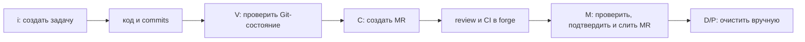
```mermaid
flowchart LR
    A["i: создать задачу"] --> B["код и commits"]
    B --> C["V: проверить Git-состояние"]
    C --> D["C: создать MR"]
    D --> E["review и CI в forge"]
    E --> F["M: проверить, подтвердить и слить MR"]
    F --> G["D/P: очистить вручную"]
```

1. В Tasks (`1`) нажмите `i`, укажите ID и сервисы. Для каждого сервиса wtui создаст `feature/<TASK>` и worktree в `<tasks_root>/<TASK>/<service>`.
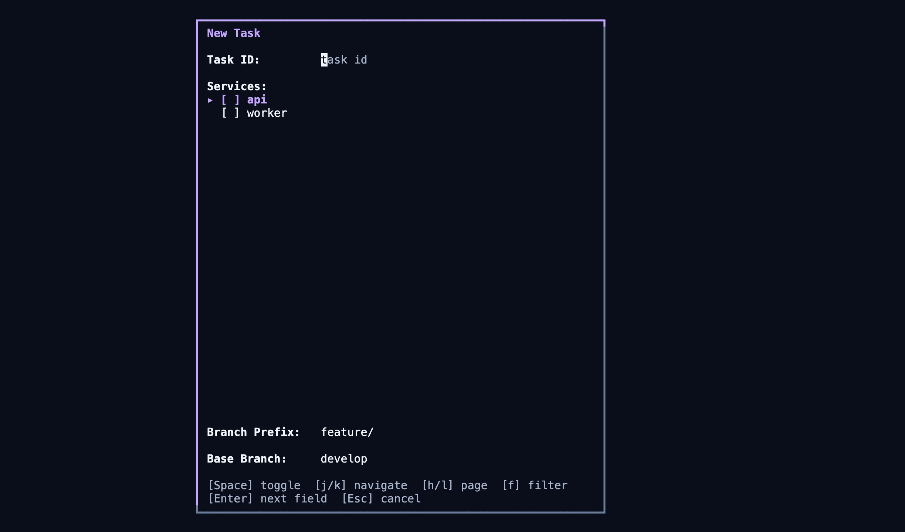
2. Нажмите `O` для редактора или `R` для Rider. Пишите код, запускайте тесты и делайте commits как обычно. В Services (`Enter` или `2`) можно добавить сервис клавишей `a` или открыть lazygit клавишей `g`.
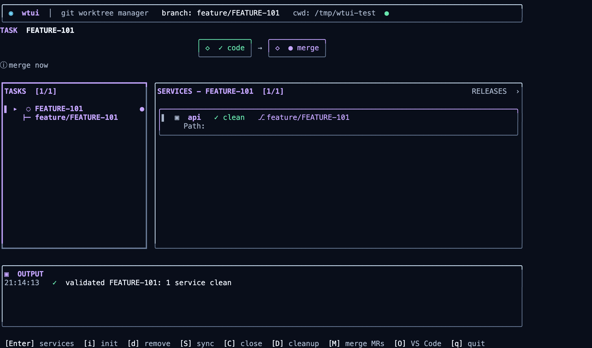
3. Нажмите `V`. Это проверка Git-состояния, а не тесты приложения. `S` синхронизирует ветки с remote.
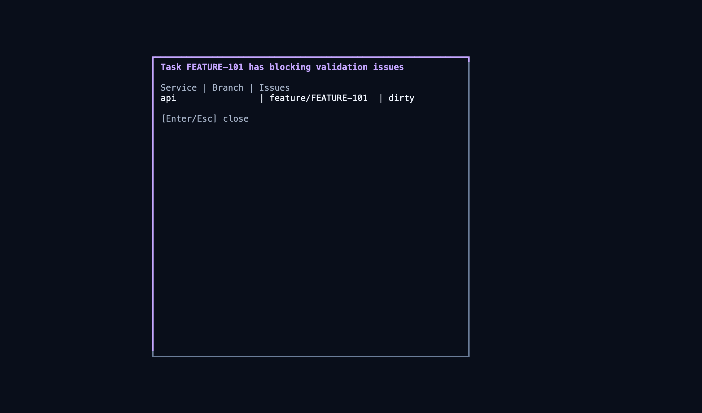
4. Нажмите `C`, проверьте план и подтвердите. При `close_strategy: review_request` wtui пушит ветки и создаёт MR в `develop`. При `direct_merge` он обновляет настроенные target-ветки без MR.
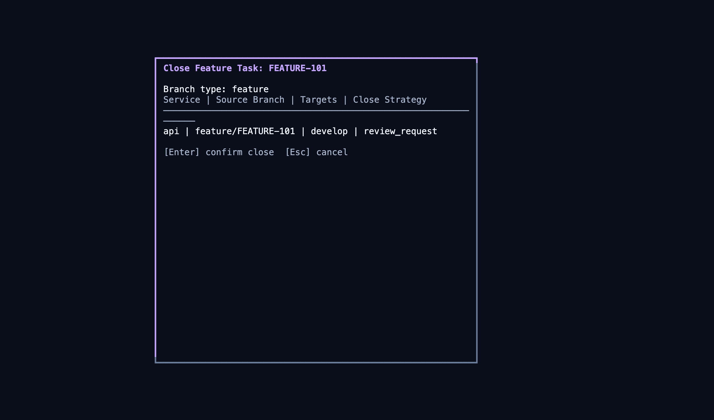
5. Проведите review и дождитесь CI в forge. wtui не удаляет задачу.

6. Когда MR готовы, нажмите `M`: wtui повторно проверит readiness, запросит подтверждение, сольёт готовые MR и повторно проверит и сохранит результат. Для одного сервиса: Services → сервис → `m`.
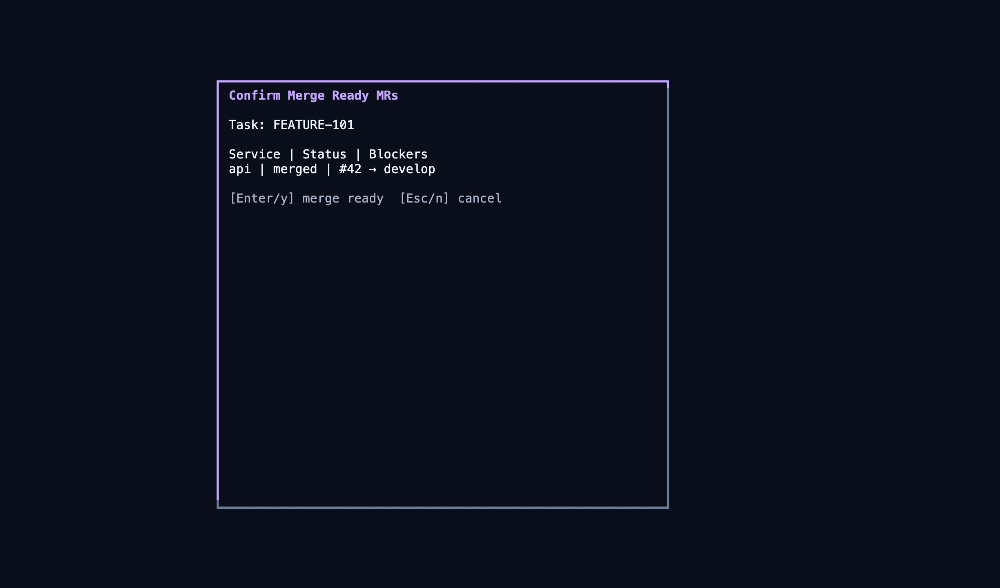
7. Когда задача больше не нужна, запустите ручную очистку через `D` или `P`.
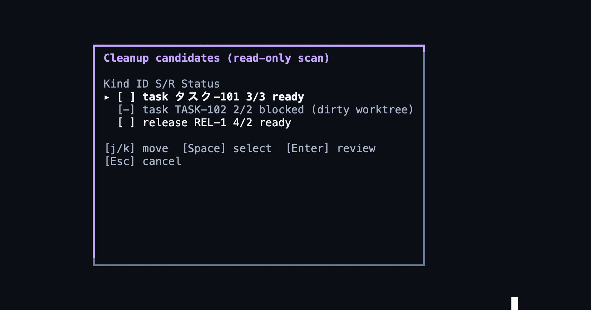

## Release

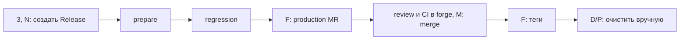
```mermaid
flowchart LR
    A["3, N: создать Release"] --> B["prepare"]
    B --> C["regression"]
    C --> D["F: production MR"]
    D --> E["review и CI в forge, M: merge"]
    E --> F["F: теги"]
    F --> G["D/P: очистить вручную"]
```

1. В Releases (`3`) нажмите `N`, выберите root feature-задачи и версии сервисов. Предложенная версия — следующий patch от локального semver-тега; без тегов — `0.1.0`.
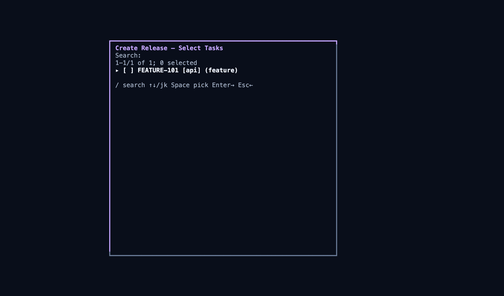
2. Проверьте preview и подтвердите prepare. По умолчанию каждая task-ветка уже должна быть в `origin/develop`. С `git_flow.task_merge.timing: release_prepare` вместо этого нужен один ready MR каждого сервиса в `develop`.
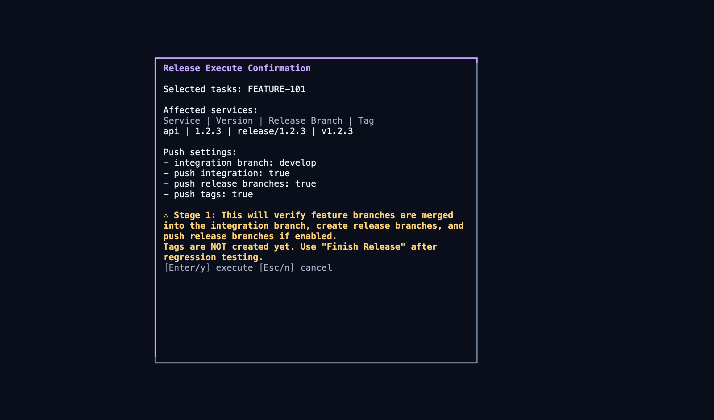
3. В статусе `prepared` выполните regression вручную. Если нужны исправления, протестируйте, закоммитьте и опубликуйте их в release-worktree до promote.
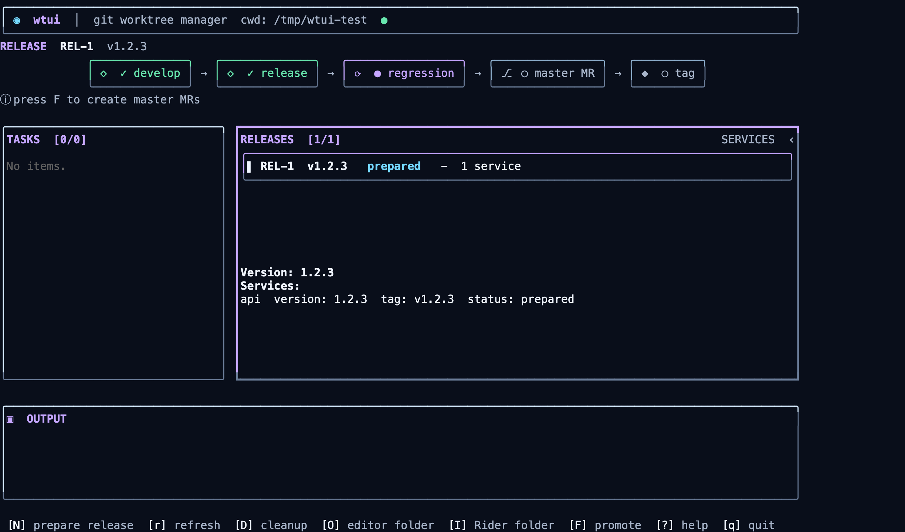
4. Нажмите `F`. wtui создаёт MR `release/<version> → master` для каждого сервиса.

5. Проведите review и дождитесь CI в forge, затем нажмите `M`. wtui проверит, подтвердит, сольёт готовые MR и сохранит принятый merge SHA.

6. Нажмите `F` ещё раз. wtui проверит `master`, вернёт release-ветку в `develop`, создаст и запушит annotated теги. Статус `released` не означает deploy.
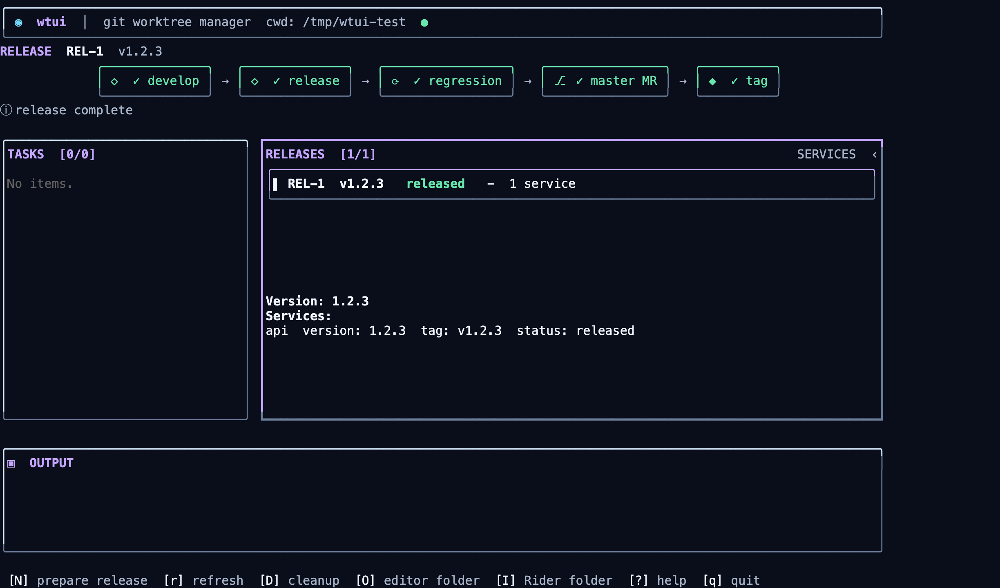
7. При необходимости очистите released release через `D` или `P`.
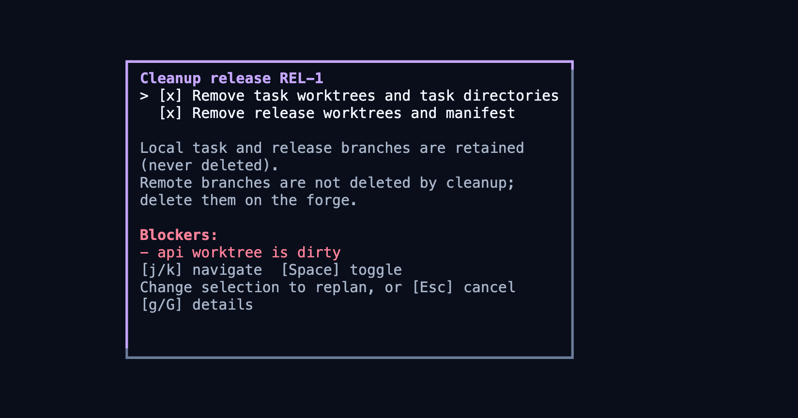

Временные integration-worktrees — внутренний ресурс prepare. По умолчанию wtui удаляет их; `release.keep_integration_worktrees: true` сохраняет их для отладки. Это не удаляет task или release каталог.

## Hotfix

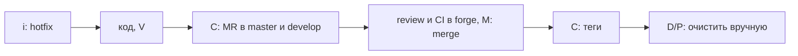
```mermaid
flowchart LR
    A["i: hotfix"] --> B["код, V"]
    B --> C["C: MR в master и develop"]
    C --> D["review и CI в forge, M: merge"]
    D --> E["C: теги"]
    E --> F["D/P: очистить вручную"]
```

1. Создайте задачу через `i`, выберите тип `hotfix`. Ветка `hotfix/<TASK>` начинается от `master`.
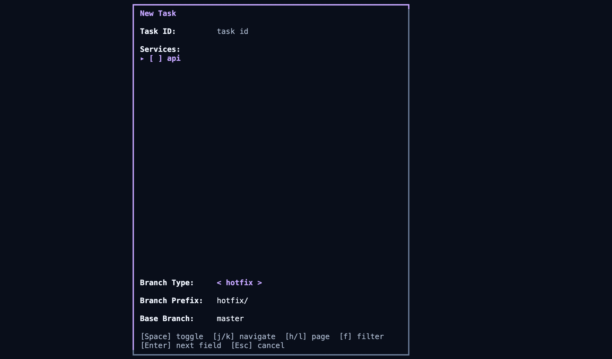
2. Разрабатывайте и проверяйте Git-состояние так же, как feature-задачу.
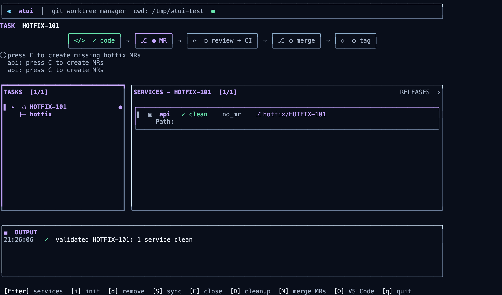
3. Нажмите `C`: wtui создаёт MR и в `master`, и в `develop`.
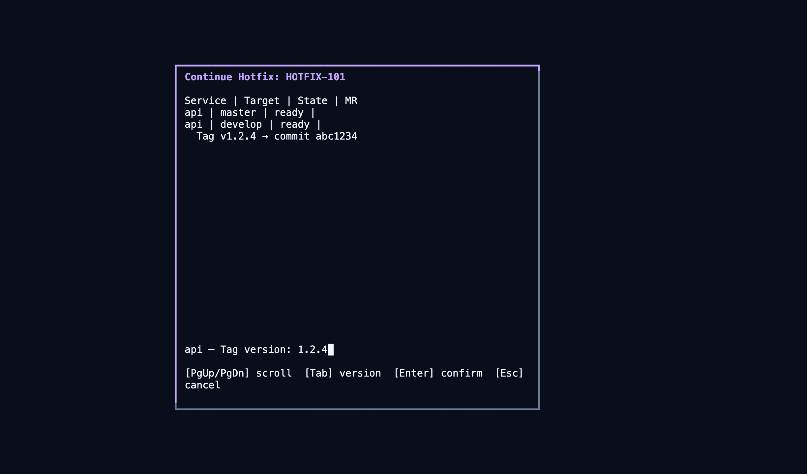
4. Проведите review и дождитесь CI для обоих MR в forge, затем нажмите `M`: wtui проверит, подтвердит и сольёт готовые MR, после чего повторно проверит и сохранит результат.
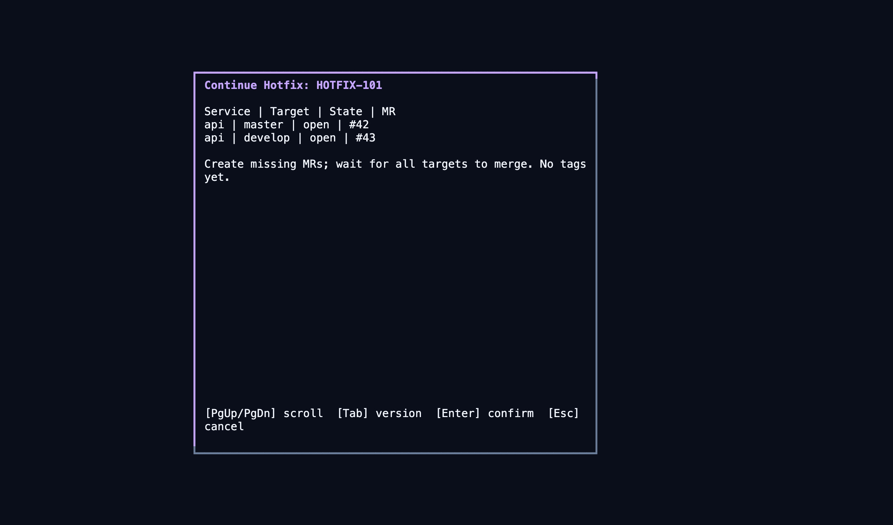
5. Повторите `C` для версий и тегов. При частичном сбое повторите `C`: checkpoint сохраняет подтверждённые версии.

6. Очистите задачу только после завершения обоих merge и post-actions.

`F` на hotfix конвертирует задачу в feature: создаёт `feature/<TARGET>` от подтверждённого SHA, пушит ветки с lease и удаляет только неизменённые локальные hotfix-ветки. Remote source-ветка сохраняется.

## Ручная очистка

Ничего не удаляется автоматически после Close, merge, тегов или finalize.

1. Нажмите `D` или `P` в Tasks либо Releases.

2. wtui покажет read-only список кандидатов.

3. Выберите задачи или released releases.
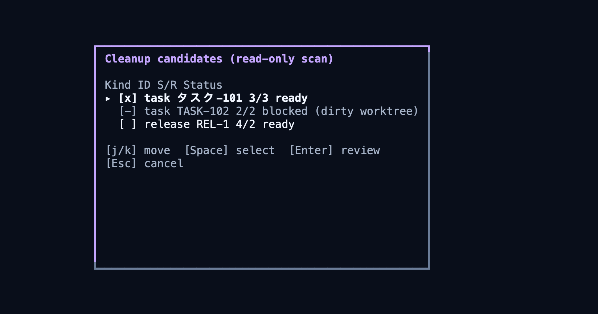
4. Каждый выбранный элемент заново планируется и требует отдельного подтверждения.
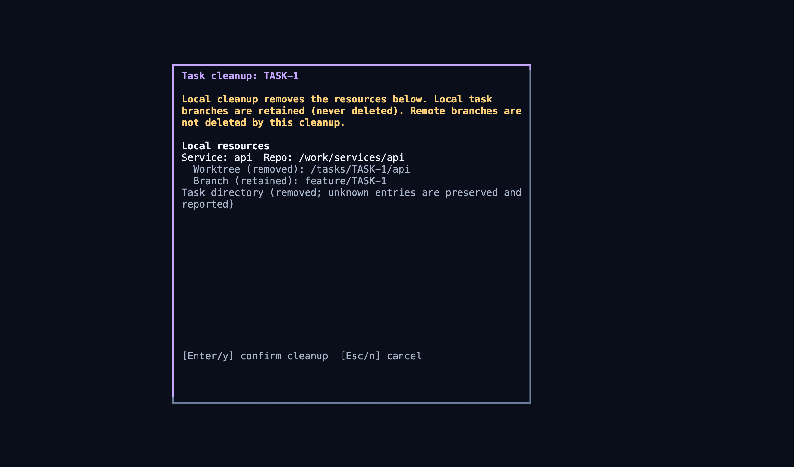

Очистка удаляет worktrees, сгенерированные метаданные и task/release каталоги. Локальные и remote ветки, а также теги, всегда сохраняются. Каталог с неизвестными файлами сохраняется и возвращает ошибку вместо рекурсивного удаления.

Подробнее: [cleanup.md](cleanup.md). Все ключи и ограничения: [configuration.md](configuration.md).

## Если операция остановилась

| Где | Что делать |
|---|---|
| Close | Проверьте push и MR, затем повторите `C`. |
| Merge check | После устранения blocker повторите `M`; он заново проверит MR перед merge. |
| Release | При recoverable `failed` используйте `R` в Releases. После частичного production merge используйте `M`, не `R`. |
| Cleanup | Уже удалённое не откатывается. Нажмите `D` или `P` и постройте новый план. |
