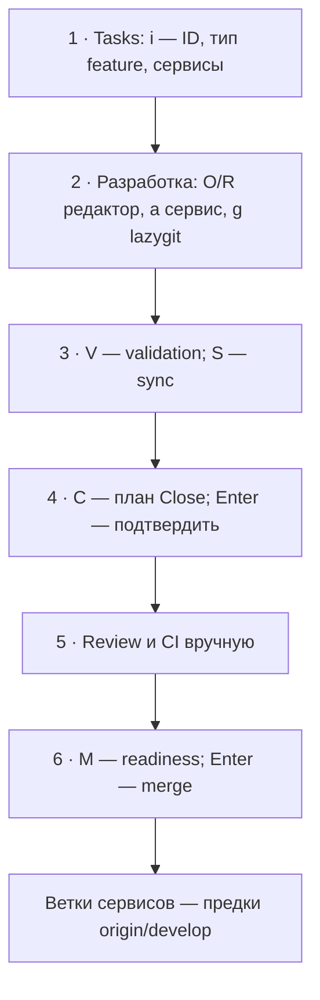
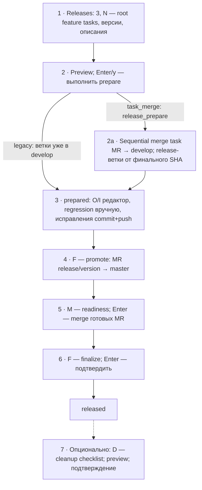
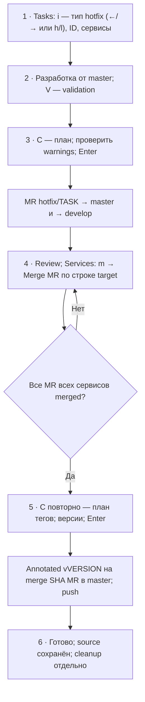

# От задачи до релиза

Задача объединяет рабочие копии нескольких сервисов. Сначала её ветки попадают в `develop` через MR. Затем отдельный Release фиксирует версии сервисов и проводит снимок `develop` через regression, production MR, обратное слияние и теги.

Документ описывает сценарии взаимодействия с TUI wtui. Каждый шаг на схеме пронумерован; под схемой сноска с тем же номером описывает, что происходит внутри шага. Поведение соответствует проверенному профилю: GitLab на частном сервере, preset `git-flow`, `develop` для интеграции, `master` для production. Чтение YAML **не доказывает**, что запущенный экземпляр использует именно его.

## Конфигурация перед запуском

`config.Load("")` берёт первый найденный файл: `$XDG_CONFIG_HOME/wtui/config.yaml` → `~/.config/wtui/config.yaml` → `config.yaml` рядом с бинарём. Файлы не объединяются. Непустые `WTUI_ROOT`, `TASKFLOW_ROOT`, `EDITOR`, `WTUI_BASE_BRANCH` переопределяют соответствующие поля. В TUI: `1` → Tasks → `,` — effective config; `.` — доступность инструментов и forge. Для MR нужен авторизованный `glab`; запись `forge` в YAML авторизацию не подтверждает. Источник: [config.go](../internal/config/config.go).

## Поток 1. Feature-задача

```mermaid
flowchart TD
    F1["1 · Tasks: i — ID, тип feature, сервисы"] --> F2["2 · Разработка: O/R редактор, a сервис, g lazygit"]
    F2 --> F3["3 · V — validation; S — sync"]
    F3 --> F4["4 · C — план Close; Enter — подтвердить"]
    F4 --> F5["5 · Review и CI вручную"]
    F5 --> F6["6 · M — readiness; Enter — merge"]
    F6 --> F7["Ветки сервисов — предки origin/develop"]
```

**1.** `1` → `i`: Task ID, сервисы пробелом, `Tab` / `Shift+Tab` между полями, `Enter` на последнем поле создаёт задачу. На сервис создаётся worktree `<tasks_root>/<TASK>/<service>` и ветка `feature/<TASK>` от `develop`. При remote-конфликте ветки TUI предлагает стратегию — проверьте выбранную ветку, не считайте её новой. Источники: [init](../internal/task/init.go), [диалог](../internal/tui/modal/init_dialog.go).

**2.** `O` в Tasks — VS Code workspace, `R` — solution в Rider; `Enter` / `2` — в Services; там `a` — добавить сервис, `g` — lazygit. Сбой генерации `.sln` не откатывает созданные worktrees. Код, тесты и коммиты выполняете вы. В профиле нет `worktree.copy`: ignored/untracked файлы из исходного репозитория не копируются.

**3.** `V` в Tasks / `v` в Services проверяют Git-состояние, **не запускают тесты**. `S` — выбор sync-стратегии; это не замена commit или review.

**4.** Tasks → `C` → модальное окно плана → `Enter`. Close делает fetch, push source и создаёт MR `feature/TASK → develop` на каждый сервис. Если MR для target уже существовал и был закрыт без merge либо ветка не отличается от target, план показывает предупреждение в том же окне — `Enter` подтверждает создание, `Esc` отменяет. Успешный Close = создание MR, **не** merge и не удаление задачи. Тега feature, удаления source-ветки и запуска pipeline в этом профиле нет. Источник: [close](../internal/task/close.go).

**5.** Review и CI — вне wtui. Readiness не гарантирует зелёный CI: [GitLab-клиент](../internal/forge/glab.go) учитывает состояние MR, approval/merge-status, конфликты и обсуждения; pipeline status только информирует. Проверяйте CI отдельно.

**6.** Tasks → `M` → просмотр readiness → подтверждение. Сливаются готовые MR с `merge_commit`; неготовые пропускаются. Per-service путь: Services → `m` → `Merge MR`. Отдельный обходной путь Services → `m` → `Create missing MR/PRs` обходит **все сервисы задачи** с общим заголовком, пропускает открытые MR, но не делает Close-план, validation и push source — и перед созданием показывает окно подтверждения, если MR уже существовал (закрыт) или нет разницы с target-веткой; `Enter`/`y` — создать всё равно, `Esc`/`n` — отмена. Источники: [merge](../internal/task/mr_merge.go), [forge create](../internal/task/forge.go), [forge menu](../internal/tui/modal/forge_menu.go).

## Поток 2. Release

```mermaid
flowchart TD
    R1["1 · Releases: 3, N — root feature tasks, версии, описания"] --> R2["2 · Preview; Enter/y — выполнить prepare"]
    R2 -->|"legacy: ветки уже в develop"| R3["3 · prepared: O/I редактор, regression вручную, исправления commit+push"]
    R2 -->|"task_merge: release_prepare"| R2M["2a · Sequential merge task MR → develop; release-ветки от финального SHA"]
    R2M --> R3
    R3 --> R4["4 · F — promote: MR release/version → master"]
    R4 --> R5["5 · M — readiness; Enter — merge готовых MR"]
    R5 --> R6["6 · F — finalize; Enter — подтвердить"]
    R6 --> R7["released"]
    R7 -.-> R8["7 · Опционально: D — cleanup checklist; preview; подтверждение"]
```

**1.** `3` → Releases → `N`. В выборе задач `/` — поиск; пока поиск активен, `Space` вводит пробел, а не отмечает задачу: `Enter` — выйти из поиска, `Space` — отметить, `Enter` — к версиям. `Tab` / `Shift+Tab` переключают название, версии, описания тегов; на описании `Enter` открывает редактор (`Ctrl+S` — сохранить, `Esc` — отменить). Допускаются только root-задачи с phase `feature`. Версия задаётся **для каждого сервиса**: предложение — максимальный локальный semver-тег + patch, без тегов — `0.1.0`; fetch и Conventional Commits не анализируются. Название — отображаемый текст, не ID. Источники: [диалог](../internal/tui/modal/create_release_dialog.go), [версии](../internal/task/release_versions.go).

**2.** Preview делает fetch по каждому сервису (обновляет remote-tracking refs), но не создаёт ветки и worktrees, не выполняет merge и push. Backend-план проверяет: пустой список/повторы/неизвестные или child-задачи; reuse при активном Release и `allow_task_reuse: false`; dirty worktree и состояния `Conflicted`/`Merging`/`Rebasing`/`CherryPick`/`Reverting`/`Bisect`; конфликты имён, версий, существующих release-веток и локальных тегов. **Удалённый тег отдельно не проверяется**: конфликт может всплыть лишь при push тега на finalize. Выбор задач: учёт состава, не фильтр коммитов; в релиз входит весь итоговый снимок `develop`, включая изменения невыбранных задач. Дальше поведение зависит от `git_flow.task_merge.timing`:

- **Пусто или секция отсутствует (legacy).** Каждая task-ветка должна быть предком `origin/develop` после fetch, иначе prepare блокируется. Prepare повторно проверяет ancestry и создаёт `release/<version>` от зафиксированного SHA `origin/develop`; при `push_integration` integration-ветка публикуется из локальной копии.
- **`timing: release_prepare` (opt-in).** Ancestry не требуется: задачи могут быть ещё не слиты, но у каждой task-ветки должен быть ровно один готовый MR в `develop` (создаёт feature Close, шаг 4 потока 1). Preview показывает строки task MR (сервис, задача, MR, head SHA, target, readiness, blockers); `Enter` активен, только когда **все** строки ready. Подтверждение привязывает точный план: состав, версии и релевантная конфигурация проверяются заново при выполнении. MR сливаются последовательно в детерминированном порядке (сервис, задача, номер MR), и перед каждым merge MR перечитывается: смена source/target/head SHA, состояния или readiness останавливает выполнение. Действует rolling target SHA: первый MR сервиса целится в показанный в preview tip `develop`, каждый следующий обязан указывать на принятый merge SHA предыдущего MR этого сервиса. Автоматического обновления или rebase source-веток нет. После merge результат доказывается внешне: состояние merged, непустой merge SHA и совпадающий tip `origin/develop`. Release-ветки создаются только после того, как все task MR доказанно слиты, и от сохранённого в manifest финального принятого merge SHA, а не от текущего tip `develop`: любое движение `origin/develop` после принятия блокирует preparation. Локальный HEAD worktree задачи должен точно совпадать с head SHA MR и при preview, и при подтверждении; расхождение блокирует строку: синхронизируйте task-ветку с MR и повторите preview. Merge требует pin ожидаемого head SHA: forge без его поддержки блокирует task merge. Подтверждённый план (номер MR, head SHA, target SHA на ветку) сохраняется в manifest; неполные исторические task-MR данные fail closed, нужен свежий preview или пересоздание Release. Push integration при prepare в этом режиме не выполняется, promote/finalize не меняются.

Общее для обоих режимов: Prepare создаёт рабочие копии `<release_root>/<releaseID>/services/<service>` и публикует release-ветки; временная integration-копия удаляется. ID: `rel-{{.Version}}-{{.Timestamp}}` (UTC, `YYYYMMDDTHHmmss`); общая версия или `mixed`; при совпадении каталога суффикс `-2`, `-3`. Источники: [план](../internal/task/release_plan.go), [план task MR](../internal/task/release_prepare_plan.go), [prepare](../internal/task/release_execute.go), [merge execution](../internal/task/release_integrate.go), [ID](../internal/task/release_helpers.go).

**3.** `prepared` — не deploy. `O`/`I` открывают каталог в редакторе/Rider. Regression вручную; исправления в release-worktree нужно протестировать, закоммитить и опубликовать **до promote** — promote этого не делает.

**4.** `F` — promote: создаёт или переиспользует открытый MR `release/<version> → master` каждого сервиса, сохраняет MR number/URL и source SHA. Общий статус — `awaiting_master_merge`. Источник: [promote](../internal/task/release_promote.go).

**5.** `M` — inspect/merge. Перед merge — SHA pin, если forge поддерживает; иначе сверка head SHA. Изменение release-ветки после promote блокирует merge — разберите расхождение, не обходите. У каждого слитого MR сохраняется `AcceptedMergeSHA`; если MR слит вне wtui, `M` фиксирует результат. `master_merged` — только после всех сервисов. Источник: [production merge](../internal/task/release_merge.go).

**6.** `F` — finalize: fetch; `origin/master` каждого сервиса должен **точно совпасть** с `AcceptedMergeSHA`, иначе останов с `ERR_RELEASE_MASTER_MOVED`. Затем merge release-ветки в `develop`, push integration, annotated тег `v<version>` **на принятом production merge SHA** (не на `develop`, не на release HEAD), push тегов → `released`. Существующий тег допустим только на ожидаемом SHA. `released` — не deploy. Источник: [finalize](../internal/task/release_finish.go).

**7.** Releases → выбрать `released` → `D` → checklist → preview → отдельное подтверждение. Самостоятельная destructive-операция: по умолчанию удаляются worktrees, каталоги и локальные ветки; remote-ветки — только при явном выборе; теги не удаляются. Удаление каталога Release удаляет и manifest. Проверяются ownership путей, SHA веток/тегов, включение в remote targets; устаревший план блокируется. Частичный сбой не откатывается — стройте новый план. Tasks → `P` (Prune) — другой механизм; bool-флаги секции `prune` текущий код не использует. Источники: [cleanup plan](../internal/task/release_cleanup_plan.go), [cleanup execute](../internal/task/release_cleanup_execute.go), [prune](../internal/task/prune.go).

## Поток 3. Hotfix

Hotfix — самостоятельная задача от `master`; Release record через `N` не нужен (выбор допускает только root feature). MR создаются в **обе** ветки: `master` и `develop`.

```mermaid
flowchart TD
    H1["1 · Tasks: i — тип hotfix (←/→ или h/l), ID, сервисы"] --> H2["2 · Разработка от master; V — validation"]
    H2 --> H3["3 · C — план; проверить warnings; Enter"]
    H3 --> H4["MR hotfix/TASK → master и → develop"]
    H4 --> H5["4 · Review; Services: m → Merge MR по строке target"]
    H5 --> H6{"Все MR всех сервисов merged?"}
    H6 -->|Нет| H5
    H6 -->|Да| H7["5 · C повторно — план тегов; версии; Enter"]
    H7 --> H8["Annotated vVERSION на merge SHA MR в master; push"]
    H8 --> H9["6 · Готово; source сохранён; cleanup отдельно"]
```

**1-2.** Ветка `hotfix/<TASK>` от `master`. Работа с редактором и валидация — как в feature-потоке (шаги 2-3).

**3.** `C` строит план по истории MR каждого сервиса. Закрытые без merge MR не считаются конфликтом: целевой MR считается отсутствующим, а план показывает предупреждение «MR #N was closed without merge» — в том же окне `Enter` подтверждает создание нового. Предупреждение появляется и при отсутствии разницы с target (пустой MR). Ambiguous-ошибка остаётся только для нескольких **активных** (open/merged) MR на один target. Не используйте общее `Create missing MR/PRs` вместо hotfix Close: оно работает только с первым review target. Источник: [hotfix close](../internal/task/hotfix_close.go).

**4.** Создание двух MR не навязывает порядок их merge. Открытые MR ждут, слитые перепроверяются (identity, source SHA, merge SHA, включение в target).

**5.** Повторный `C` после всех merge даёт план обязательных тегов. Тег привязан к проверенному merge commit MR в `master`, даже если ветка продвинулась: проверяется включение merge commit, а не равенство HEAD, как у Release finalize. Состояние `.hotfix-close.json` фиксирует подтверждённые версии и identity; при частичном сбое повторите `C` — подтверждённые версии заблокированы, существующие теги должны указывать на тот же SHA.

**6.** Source-ветки сохраняются, pipeline trigger выключен. Для hotfix Prune смотрит ancestry в `origin/master` и не доказывает успешность обоих MR и тегов — сначала завершите поток по схеме.

## Профиль и stock defaults

Stock — явный `git_flow.preset: git-flow` без branch overrides, остальные секции отсутствуют, env не задан.

| Область | Проверенный профиль | Stock |
|---|---|---|
| Forge | `gitlab`, частный host | `auto`; hosts `gitlab.com` / `github.com` |
| Feature | `feature/`, база `develop`, MR в `develop`, `merge_commit`, clean | То же |
| Feature после Close | Без тега, source сохраняется, pipeline trigger выключен | То же |
| Hotfix | `hotfix/` от `master`; MR в `master` **и** `develop`; тег из `master` | `direct_merge`; targets `master`, `develop`; тег из `master` |
| Release rule | `release/` от `develop`; review в `master`; `tag_on_close: false` | То же |
| Release ID | `rel-{{.Version}}-{{.Timestamp}}` | `rel-{{.Timestamp}}` |
| Release push/worktree | `push_integration`, `push_release_branches`, `push_tags`, `create_release_worktrees`: `true` | Все четыре `true` при stock tag config |
| Release guards | `keep_integration_worktrees: false`, `allow_task_reuse: false`, `require_clean_before_merge: true` | То же |
| Task MR merge | `git_flow.task_merge` не задан: legacy ancestry-prepare | Не задан, то же |
| Tag config | Не задана → `v<version>`, semver, annotated, push | То же |
| Validation | Timeout `30s`, concurrency `8` | Timeout `10s`, остальное то же |

Оговорки defaults:

- **Без секции `git_flow` вообще** `Config.Effective()` создаёт legacy feature-rule с `close_strategy: direct_merge`: «пустая конфигурация» и «явный preset git-flow» не эквивалентны для feature Close. Для stock direct-merge hotfix код может заменить integration target активной `release/*`-веткой; configured MR-путь использует `[master, develop]`.
- Неполная секция с bool-полями — не «defaults плюс overrides»: отсутствующее `close.push_targets_after_direct_merge` остаётся `false`, хотя при отсутствующей секции default — `true`. Текущий direct-merge исполнитель всё равно делает push.

Источники: [defaults](../internal/config/config.go), [preset](../internal/gitflow/preset.go), [close](../internal/task/close.go).

## Частичные сбои и повтор

Операции над сервисами не атомарны: успешные remote merge/push не откатываются при сбое соседнего сервиса. Читайте результат по каждому сервису.

| Где остановилось | Как продолжать |
|---|---|
| Init | Добавьте недостающие сервисы через Services → `a` |
| Feature Close | Проверьте созданные MR; для недостающих — forge menu после проверки push |
| Task MR | `M` перепроверяет readiness; статусы `no_mr`, `waiting`, `ready`, `blocked`, `failed` объясняют следующий шаг |
| Release prepare/promote/finalize | При `failed` и `Error.Recoverable: true` доступен `R` в Releases; backend выбирает стадию по `PreparedAt` и accepted SHA. Если все выбранные task MR доказанно слиты внешне, восстановление продолжает только preparation от сохранённого принятого SHA: без повторного merge MR и без push integration |
| Task MR merge при `timing: release_prepare` | `R` в Releases при `awaiting_task_merge`/`task_merge_blocked`/`task_merge_partial`/`integrating_tasks`: свежий preview, затем явное подтверждение, затем merge оставшихся и продолжение prepare. Уже слитые MR должны быть доказаны внешне (состояние merged, identity, merge SHA в target); неопределённый merge не повторяется вслепую |
| Частичный production merge | Повторите `M`, не `R`: слитые MR распознаются, незавершённые перепроверяются |
| Master/tag SHA drift | Остановиться и разобраться; `ERR_RELEASE_MASTER_MOVED` и `ERR_RELEASE_RETRY_UNSAFE` не для слепого `R` |

Release manifest хранит общий и per-service status, refs/SHA, MR, признаки push, checkpoint и ошибку. Нормальный prepare: `draft → validating → merging → branching → pushing → prepared`; `merging` **не означает** cherry-pick выбранных задач. При `timing: release_prepare` вместо прямого перехода в `merging`: `validating → awaiting_task_merge → integrating_tasks → merging`; сбой до первого слитого MR даёт `task_merge_blocked`, после хотя бы одного: `task_merge_partial`; per-branch состояние (`pending`/`attempting`/`merged`/`unknown`, номер MR, SHA) сохраняется в manifest и используется retry-планом. Далее: `awaiting_master_merge → master_merged → syncing_develop → tagging → pushing → released`. `R` доступен для отмеченного recoverable `failed` и для перечисленных task-merge статусов; для `failed` с сохранёнными task-MR данными retry только доводит preparation от принятого SHA, без нового merge MR. Источники: [retry](../internal/task/release_retry.go), [task merge retry](../internal/task/release_task_merge_retry.go), [manifest](../internal/task/release_store.go), [workflow](../internal/task/workflow.go).
